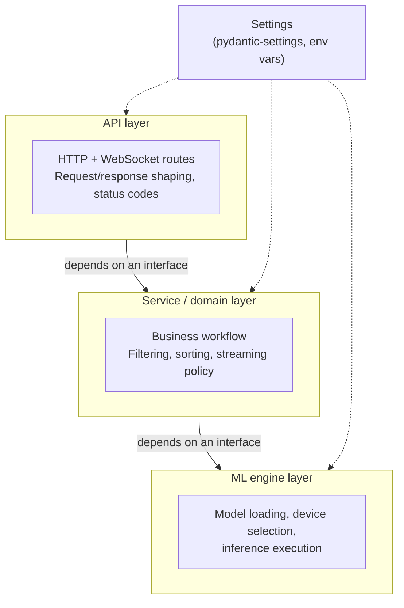

# Architecture

This document explains **why** the codebase is shaped the way it is, and **what**
pattern it follows. It's written for anyone onboarding onto this project, or for
future-us revisiting a decision six months from now and needing the reasoning
back, not just the result.

If you want the step-by-step transformation and a full file-by-file reference,
see [`PHASE_1_REFACTORING_GUIDE.md`](PHASE_1_REFACTORING_GUIDE.md). This document
stays one level up, at the level of pattern and principle.

---

## 1. The problem with the original script

The original implementation was a monolithic script: API routes, model loading,
and inference logic were all tangled together in the same functions. Concretely,
that produced:

- **Tight coupling.** A single route function did four unrelated jobs: HTTP
  validation, reaching into global state, business rules (threshold filtering,
  sorting), and knowing the internal shape of a Hugging Face `Pipeline` object.
  Any change to *how* the model runs touched the same code that parses an
  `UploadFile`.

- **A global mutable dict as the dependency mechanism.** A bare `state = {}`
  dict acted as a service locator — routes reached out and *pulled* what they
  needed by string key (`state.get("detector")`), rather than *declaring* what
  they needed. Nothing in a route's signature told you it depended on a model;
  you found out by reading the function body.

- **No seam for testing.** Testing threshold-filtering logic required loading
  real model weights into memory — seconds per test run, real GPU/CPU
  contention in CI, and testing Hugging Face's pipeline as much as any of our
  own logic.

- **No seam for scaling.** Swapping the inference backend (a different model,
  ONNX Runtime, a remote inference server) would have required touching every
  place that referenced the raw pipeline object directly, because nothing stood
  between "a route" and "a specific Hugging Face object."

- **Config as magic literals.** Model name and default threshold were hardcoded
  — in more than one place — with no environment awareness. Different weights
  or a different device per environment meant editing source code.

- **A live symptom of all of the above:** the original `endpoints.py` contained
  two full, inconsistent sets of imports and a duplicated router — one importing
  from a `backend.*` package, the other from an `app.*` package. That's what
  happens *structurally* when there's no clear boundary telling you where a
  piece of logic belongs: code gets copy-pasted and half-refactored, and the
  duplication goes unnoticed because nothing forces a single source of truth.

## 2. The layered architecture pattern

The fix is to separate code along **axis of change**, not by what file it
happens to live in. Three layers, each owning one reason to change:



- **API layer** (`api/`) — owns HTTP/WebSocket concerns only: parsing requests,
  status codes, translating domain results into response shapes. It does not
  know *how* detection happens, only *that* something can detect.

- **Service / domain layer** (`services/`) — owns the business workflow: "given
  image bytes and a threshold, produce ranked detections." Domain rules —
  filtering, sorting, frame-prioritization policy for the live stream — live
  here. This layer doesn't know whether it's being called from a REST `POST` or
  a WebSocket frame.

- **ML engine layer** (`ml/`) — owns everything infrastructure-specific to
  running the model: device selection, loading, warmup, and translating raw
  model output into our own data shapes. This is the *only* place
  `transformers`/`torch` are imported.

**Dependencies point downward, through an interface, never upward and never
sideways into a concrete implementation.** The API layer depends on "something
that can run detection," not on a concrete `DetectionService` class. The
service layer depends on "something that satisfies the `DetectionEngine`
contract" (a `Protocol` defined in `ml/base.py`), not on `transformers.pipeline`
specifically. That's what lets the bottom layer be replaced — say, swapping
YOLOS for a fine-tuned ONNX model, or a remote inference server — without a
single line changing above it.

**Config is cross-cutting, not layered.** Every layer might need a setting, but
no layer *owns* configuration — it's provided from outside, which is why it
sits beside the stack rather than inside it.

### Why this specific split, and not something else

The test for where a piece of logic belongs: **ask why it would change.**

- Something changes because of *how a request arrives* (JSON body vs. binary
  WebSocket frame, HTTP status codes, query parameter parsing) → API layer.
- Something changes because of *product/business rules* (what counts as a valid
  detection, how to prioritize frames under load, what the public response
  shape looks like) → service layer.
- Something changes because of *the model or inference backend* (framework,
  device, weights, batching strategy) → ML engine layer.

If two of these reasons are tangled in the same function, that function will be
touched by unrelated changes — which is exactly the coupling problem this
architecture exists to remove.

## 3. Dependency Injection via FastAPI's `Depends`

Dependency Injection means a function **declares** what it needs in its
signature, and something external **provides** it at call time — instead of the
function reaching out to fetch it itself (as the original `state.get("detector")`
pattern did).

FastAPI's `Depends` is the resolution mechanism: write a provider function once,
and FastAPI calls it and hands you the return value as a parameter.

```python
@router.post("/detect")
async def detect(
    service: DetectionService = Depends(get_detection_service),
): ...
```

### Why this matters specifically for ML workloads

- **Testability with heavy objects.** Model weights are expensive to load. With
  DI, `app.dependency_overrides[get_engine] = lambda: FakeEngine()` swaps in a
  fake engine in one line for tests — no GPU, no weights, sub-millisecond test
  runs. That's not possible when code reaches into global state directly.

- **Explicit, self-documenting contracts.** Reading a route's signature tells
  you exactly what it needs. No hunting through a dict of stringly-typed keys.

- **Centralized lifecycle management.** The invariant "one model instance per
  process" lives in exactly one function (`get_engine`) instead of being
  implicitly assumed at every call site that happens to reach into `app.state`.

- **Transport-aware error handling.** `HTTPException` and WebSocket disconnects
  behave differently — a REST-specific dependency (`get_engine`) and a
  WebSocket-specific one (`get_engine_ws`) can share the same lookup logic
  while raising the transport-appropriate error type. See
  `PHASE_1_REFACTORING_GUIDE.md` for the concrete bug this avoids.

## 4. Configuration management with `pydantic-settings`

`pydantic-settings` gives the project a single, typed, validated source of
truth for every environment-dependent value: model name, device preference,
default threshold, queue sizes.

```python
class Settings(BaseSettings):
    model_config = SettingsConfigDict(env_file=".env", env_prefix="APP_")
    model_name: str = "hustvl/yolos-tiny"
    default_threshold: float = 0.5
    device_preference: str = "auto"
    frame_queue_maxsize: int = 1
```

### Why this matters in production

1. **Fail fast at startup.** If a required setting is missing or malformed, the
   process refuses to start — rather than crashing three requests into
   production at 2 a.m.
2. **Same code, different environment.** Dev, staging, and prod become a matter
   of different `.env` files or environment variables, never source edits —
   the core promise of twelve-factor configuration.
3. **Composes naturally with DI.** `get_settings()` (wrapped in `lru_cache` to
   act as a cheap singleton) can be injected anywhere and overridden in tests
   the same way an engine can.

## 5. Design principles this architecture is applying

- **Single Responsibility Principle** — each module has exactly one reason to
  change (see §2's "why this specific split").
- **Dependency Inversion** — higher layers depend on abstractions
  (`DetectionEngine` as a `Protocol`), not concrete implementations
  (`YolosDetectionEngine`). Concrete implementations depend on the abstraction
  too, by satisfying it — the arrow of dependency points at the interface from
  both sides.
- **Open/Closed Principle** — adding a new model, a model registry, or a GPU
  worker pool means writing a new class that satisfies an existing interface,
  not modifying the routes or service that already work.

## Further reading

- [`PHASE_1_REFACTORING_GUIDE.md`](PHASE_1_REFACTORING_GUIDE.md) — the concrete,
  step-by-step transformation, decision rules for "what belongs in the service
  layer," and a complete reference of every file in the new structure.
