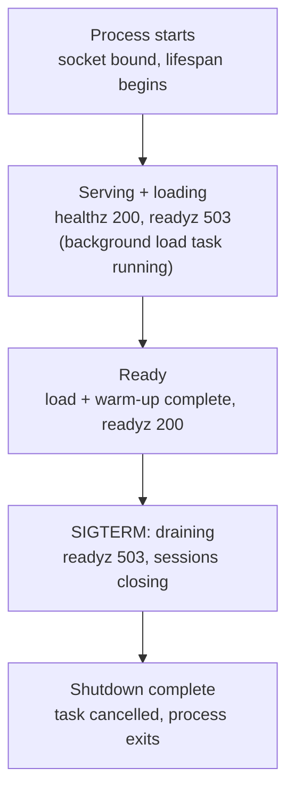

# Phase 2, Step 2: operational health, liveness, and readiness

This is the working reference for turning `lifespan.py` from "wires the engine
into `app.state`" into something an orchestrator (Kubernetes, AWS ECS, or
anything else speaking the same health-check vocabulary) can safely use to
manage a fleet of these containers under real traffic.

Read [`ARCHITECTURE.md`](ARCHITECTURE.md) and
[`PHASE_1_REFACTORING_GUIDE.md`](PHASE_1_REFACTORING_GUIDE.md) first if you
haven't — this assumes the layered structure and the `DetectionEngine`
contract already exist. It also extends that contract, which has one
consequence worth knowing before Part D: it affects the `FakeDetectionEngine`
built in
[`PHASE_2_STEP_1_TESTING_GUIDE.md`](PHASE_2_STEP_1_TESTING_GUIDE.md) — see
Part E.

---

## Part A — Architectural rationale

### Liveness vs. readiness, and why the naive version breaks on a 10–30s model load

The distinction matters because each probe's *failure* triggers a different
remedy:

- **Liveness failing → the orchestrator kills and restarts the container.**
  A statement of "this process is unrecoverable, intervene."
- **Readiness failing → the orchestrator stops routing new traffic to it, but
  leaves it running.** A statement of "this process is fine, just not ready
  for work yet."

Conflating them is the most common mistake in ML service health checks. If
`/healthz` (liveness) checked "is the model loaded," then for the entire
10–30 seconds `hustvl/yolos-tiny` is loading, liveness would report failure —
and Kubernetes' response to sustained liveness failure is to restart the
container. It restarts, starts loading again, fails liveness again during the
load window, restarts again. **A normal cold start becomes a crash loop.**
This doesn't show up in local testing; it only appears under real
orchestration, where it looks like the pod is crash-looping for no reason.

A second, easier trap sits right next to it: if the model load runs
synchronously *before* the ASGI server starts accepting connections at all,
`/healthz` isn't reachable during that window — not "returns unhealthy," but
connection-refused, which a liveness probe treats as failure the same as an
explicit 5xx. The fix isn't only "don't check the model in `/healthz`" — it's
that **the server must start accepting connections before the model finishes
loading**, so there's something for liveness to successfully answer during
that window. That's why the engine load in `lifespan.py` (Part D) runs as a
background task kicked off just before `yield`, never awaited before it.

With that fixed:

- **`/healthz`** answers "is the process alive and is the event loop
  responsive?" Nothing more. Returns `200` within milliseconds of container
  start and stays `200` through the entire load window.
- **`/readyz`** answers "can this instance correctly serve a `/detect` or
  `/ws/detect` request right now?" Returns `503` from process start until the
  engine's status is fully `READY`, then flips to `200` — and can flip back
  later (shutdown draining) without anyone restarting the container.

**One deliberate exception:** liveness generally ignores engine status,
*except* for a permanent load failure. If `load()`/`warm_up()` raise and never
recover, readiness will correctly stay `503` forever — but the pod stays
"alive" and never gets a chance to self-heal via restart. Since a restart is
exactly the right remedy for a class of transient failures (a flaky download,
a driver init race), liveness treats only the terminal `FAILED` state as
unhealthy too. `NOT_LOADED` and `LOADING` remain liveness-neutral.

### The thundering herd, and why readiness is the mechanism that prevents it

"Thundering herd" describes a resource that isn't ready for load getting hit
with a burst of demand all at once, with the resulting failures cascading
rather than staying contained. Here it's specific and avoidable: a rolling
deployment (or scale-up under traffic) brings up N new pods roughly
simultaneously. If the orchestrator routes traffic to a pod the instant its
container is `Running` — with no signal for "is this thing actually able to do
the work" — every one of those pods gets hit with real requests during its
10–30s load window. Each request hangs, times out, or fails; clients and
upstream load balancers typically retry failed requests, so the failures
generate *more* requests, right as the fleet is already at its most fragile
(mid-rollout, capacity temporarily reduced).

A readiness probe breaks this at the only point that matters: it controls
whether a pod is in the orchestrator's routable endpoint set at all. A pod
reporting `503` on `/readyz` isn't sent traffic — not "sent traffic and
expected to cope." The herd never arrives, because the orchestrator never lets
it through the door. This is also why the readiness check itself must stay
cheap and side-effect-free (reading an in-memory status flag, never running a
real inference) — an expensive readiness check just relocates the
thundering-herd problem onto the probe mechanism itself.

### Graceful shutdown for open WebSocket streams

`SIGTERM` asks a process to shut down cleanly before the runtime escalates to
`SIGKILL` after a grace period (Kubernetes' default `terminationGracePeriodSeconds`
is 30s). For REST this is almost a non-event — requests are short-lived and
drain naturally once the orchestrator stops routing new ones in. **A
long-lived WebSocket doesn't drain on its own** — a client streaming to
`/ws/detect` keeps sending until either side closes the connection, so without
explicit handling, a rollout severs every active stream mid-frame, and the
client sees an abrupt reset rather than a clean disconnect.

"Graceful" means four things, in order:

1. **Stop advertising readiness immediately.** The instant `SIGTERM` arrives,
   `/readyz` starts returning `503`, independent of whether the engine itself
   is still loaded and functional — this is a *shutdown* state, not an
   *engine* state, tracked as its own flag.
2. **Reject brand-new WebSocket upgrade requests.** There's an unavoidable
   propagation delay between "readiness flips to 503" and "the load balancer
   actually stops routing here." A request might still land during that
   window; the right response is an immediate clean close, not accepting a
   session that's torn down seconds later.
3. **Give already-connected clients a bounded grace period, then close
   cleanly** — a real close frame with code `1001` ("Going Away"), not the
   connection just vanishing.
4. **Only then let the process exit**, comfortably inside the grace period,
   not up against it.

---

## Part B — Lifecycle timeline



1. **Process starts.** The ASGI server binds the socket; FastAPI's `lifespan`
   begins executing. `app.state.engine` is constructed here — status
   `NOT_LOADED` — and published immediately, before any loading happens, so
   `app.state` is never half-populated for anything that reads it.
2. **Background load task fires, then `yield` is reached almost
   immediately.** `engine.load()` is *not* awaited inline — it's wrapped in
   `asyncio.create_task(...)` and the lifespan proceeds straight to `yield`.
   The server now accepts connections. `/healthz` is reachable and returns
   `200`. `/readyz` is also reachable and correctly returns `503`
   (`NOT_LOADED` → `LOADING`).
3. **Concurrently**, the background task runs device resolution, then
   `transformers.pipeline(...)` construction (the slow, 10–30s part), then a
   warm-up inference against a throwaway blank image — absorbing any
   first-call cost (lazy CUDA context, JIT tracing) before it can land on a
   real user's request.
4. **Status flips to `READY`.** `/readyz` returns `200` on the next probe;
   the orchestrator adds the pod to the traffic-serving pool.
5. **Steady state.** Both probes stay cheap — reading an in-memory enum, no
   real work.
6. **`SIGTERM` arrives.** The shutdown flag flips first, so `/readyz` returns
   `503` on the very next probe before anything else happens. New WebSocket
   upgrades are rejected. Active sessions are enumerated and each is sent a
   clean close frame, with a bounded grace period for in-flight processing.
7. **Cleanup and exit.** Once every session is closed (or the grace period
   elapses and stragglers are force-cancelled), the lifespan function returns
   past `yield` and the process exits — comfortably before `SIGKILL`.

---

## Part C — What changed in the layout

```
src/backend/
├── lifespan.py               # rewritten: background load task, shutdown draining
├── dependencies.py           # + get_engine_or_none for the health routes
├── api/
│   ├── schemas.py            # + LivenessResponse, ReadinessResponse
│   └── routes/
│       ├── __init__.py       # + health router
│       ├── health.py         # NEW — /healthz, /readyz
│       └── streaming.py      # + active_sessions registration, shutdown check
└── ml/
    ├── base.py                # + EngineStatus enum, DetectionEngine.status
    └── yolos_engine.py        # + status tracking, warm_up(), fail-fast load()
```

`api/routes/detection.py` is unchanged — REST requests are short-lived and
self-draining once the orchestrator stops routing new ones in; only the
long-lived WebSocket connections need proactive draining.

---

## Part D — Full file reference

### `ml/base.py`

```python
from enum import Enum
from typing import Protocol, runtime_checkable
from PIL import Image
from .schemas import Detection


class EngineStatus(str, Enum):
    """
    Finer-grained than a boolean on purpose. is_ready alone can't tell a
    caller 'still loading, give it a few more seconds' apart from
    'failed permanently, this pod will never become healthy' — and an
    orchestrator needs to treat those two cases very differently.
    """
    NOT_LOADED = "not_loaded"
    LOADING = "loading"
    READY = "ready"
    FAILED = "failed"


@runtime_checkable
class DetectionEngine(Protocol):
    def predict(self, image: Image.Image, threshold: float) -> list[Detection]: ...

    @property
    def status(self) -> EngineStatus: ...

    @property
    def is_ready(self) -> bool:
        """Convenience for callers that only care about the binary
        question — equivalent to status == EngineStatus.READY. The
        feature routes (get_engine / get_engine_ws) keep using this
        unchanged; only the health routes need the richer status."""
        ...
```

### `ml/yolos_engine.py`

```python
import logging
import torch
from PIL import Image
from transformers import pipeline, Pipeline
from .base import EngineStatus
from .schemas import BoundingBox, Detection

logger = logging.getLogger(__name__)

class YolosDetectionEngine:
    def __init__(self, model_name: str, device_preference: str = "auto") -> None:
        self._model_name = model_name
        self._device = self._resolve_device(device_preference)
        self._pipeline: Pipeline | None = None
        self._status: EngineStatus = EngineStatus.NOT_LOADED

    @staticmethod
    def _resolve_device(preference: str) -> int | str:
        if preference != "auto":
            return preference
        if torch.cuda.is_available():
            return 0
        if torch.backends.mps.is_available():
            return "mps"
        return "cpu"

    @property
    def status(self) -> EngineStatus:
        return self._status

    @property
    def is_ready(self) -> bool:
        return self._status == EngineStatus.READY

    def load(self) -> None:
        """
        Device resolution + weight loading only. Deliberately does NOT
        flip status to READY — that's warm_up()'s job — so a caller can
        observe 'weights loaded, warming up' as a distinct state from
        'fully ready', which lifespan.py relies on.
        """
        self._status = EngineStatus.LOADING
        logger.info("Loading %s on device=%s", self._model_name, self._device)
        try:
            self._pipeline = pipeline(
                task="object-detection", model=self._model_name, device=self._device
            )
        except Exception:
            self._status = EngineStatus.FAILED
            # Fail fast: propagate rather than swallow. A retry-with-backoff
            # for transient network errors belongs INSIDE this try block —
            # a few attempts before giving up — but once attempts are
            # exhausted, re-raising is deliberate.
            logger.exception("Engine failed to load")
            raise

    def warm_up(self) -> None:
        """One throwaway inference before signaling READY — absorbs
        first-call costs (lazy CUDA context, JIT tracing) that would
        otherwise land on the first real user request after a deploy."""
        if self._pipeline is None:
            raise RuntimeError("warm_up() called before load()")
        try:
            self._pipeline(Image.new("RGB", (32, 32)))
        except Exception:
            self._status = EngineStatus.FAILED
            logger.exception("Engine warm-up failed")
            raise
        self._status = EngineStatus.READY

    def predict(self, image: Image.Image, threshold: float) -> list[Detection]:
        if not self.is_ready:
            raise RuntimeError("predict() called before the engine is ready")
        with torch.inference_mode():
            raw = self._pipeline(image)
        return [
            Detection(
                label=r["label"],
                score=float(r["score"]),
                box=BoundingBox(**{k: int(v) for k, v in r["box"].items()}),
            )
            for r in raw
            if r["score"] >= threshold
        ]
```

### `dependencies.py` — addition

```python
from fastapi import Request
from .ml.base import DetectionEngine

def get_engine_or_none(request: Request) -> DetectionEngine | None:
    """
    Used ONLY by /healthz and /readyz. The feature-route dependencies
    (get_engine, get_engine_ws) deliberately raise on an unready engine —
    exactly what you want for a request that can't proceed. Health
    routes need the opposite: inspect status and return a deliberately
    shaped JSON body with the right status code either way. A raised
    HTTPException would short-circuit that into FastAPI's generic
    {"detail": ...} envelope, which isn't what a probe or dashboard wants.
    """
    return getattr(request.app.state, "engine", None)
```

`get_engine` and `get_engine_ws` are otherwise unchanged from Phase 1.

### `api/schemas.py` — additions

```python
from typing import Literal
from pydantic import BaseModel
from ..ml.schemas import Detection

# ... DetectionOut / DetectionResponse unchanged from Phase 1 ...

class LivenessResponse(BaseModel):
    """Deliberately its own vocabulary, separate from ml.base.EngineStatus
    — the same reason DetectionOut exists apart from Detection. Wire
    format is free to diverge from the domain model."""
    status: Literal["alive", "unhealthy"]
    reason: str | None = None


class ReadinessResponse(BaseModel):
    status: Literal["ready", "not_ready"]
    engine_status: str | None = None
    reason: str | None = None
```

### `api/routes/health.py`

```python
from fastapi import APIRouter, Depends, Request, Response, status

from ...dependencies import get_engine_or_none
from ...ml.base import DetectionEngine, EngineStatus
from ..schemas import LivenessResponse, ReadinessResponse

router = APIRouter()


@router.get("/healthz", summary="Liveness probe", response_model=LivenessResponse)
async def liveness(
    engine: DetectionEngine | None = Depends(get_engine_or_none),
) -> LivenessResponse:
    """
    Is this process alive and able to handle an HTTP request at all?
    Deliberately does NOT check whether the engine is loaded — see Part A
    for why checking that here turns a normal cold start into a restart
    loop. The one exception: a PERMANENTLY failed engine load.
    """
    if engine is not None and engine.status == EngineStatus.FAILED:
        return LivenessResponse(status="unhealthy", reason="engine_failed")
    return LivenessResponse(status="alive")


@router.get("/readyz", summary="Readiness probe", response_model=ReadinessResponse)
async def readiness(
    response: Response,
    request: Request,
    engine: DetectionEngine | None = Depends(get_engine_or_none),
) -> ReadinessResponse:
    """
    Can this instance correctly serve a request RIGHT NOW? Checked in
    order: are we mid-shutdown (independent of engine state entirely),
    then is the engine actually READY.

    Injecting `Response` directly lets us set a non-200 status code while
    still returning a normal Pydantic model that FastAPI serializes to
    JSON — no need to construct a JSONResponse by hand, and both the
    healthy and unhealthy case return the same documented shape.
    """
    if request.app.state.shutting_down:
        response.status_code = status.HTTP_503_SERVICE_UNAVAILABLE
        return ReadinessResponse(status="not_ready", reason="shutting_down")

    if engine is None or engine.status != EngineStatus.READY:
        response.status_code = status.HTTP_503_SERVICE_UNAVAILABLE
        return ReadinessResponse(
            status="not_ready",
            engine_status=engine.status.value if engine else "not_loaded",
        )

    return ReadinessResponse(status="ready", engine_status=engine.status.value)
```

### `backend/lifespan.py` — the complete file

```python
import asyncio
import logging
from contextlib import asynccontextmanager

from fastapi import FastAPI

from .config import get_settings
from .ml.yolos_engine import YolosDetectionEngine

logger = logging.getLogger(__name__)

# Comfortably under Kubernetes' default terminationGracePeriodSeconds (30s) —
# leaves buffer for the drain itself plus process exit before SIGKILL lands.
SHUTDOWN_GRACE_PERIOD_SECONDS = 10


@asynccontextmanager
async def lifespan(app: FastAPI):
    settings = get_settings()
    engine = YolosDetectionEngine(settings.model_name, settings.device_preference)

    # Published immediately, before any loading happens — app.state is
    # never half-populated, and /healthz + /readyz are both meaningful
    # from the first millisecond of the process's life.
    app.state.engine = engine
    app.state.active_sessions = set()   # open WebSockets — see graceful shutdown
    app.state.shutting_down = False     # readyz consults this independently of engine.status

    # Fire-and-forget: NOT awaited here. This is what lets the server
    # start accepting connections immediately below, instead of the
    # whole app being unreachable for the entire 10-30s load window.
    load_task = asyncio.create_task(_load_and_warm_engine(engine))

    yield  # <-- server now accepting connections; engine may still be loading

    # ---------------- Shutdown path (triggered by SIGTERM) ----------------
    logger.info("Shutdown: marking not-ready, no longer accepting new work")
    app.state.shutting_down = True   # readyz flips to 503 on the very next probe

    if not load_task.done():
        load_task.cancel()  # loading never finished — no point continuing it

    await _drain_active_sessions(app.state.active_sessions)
    logger.info("Shutdown complete")


async def _load_and_warm_engine(engine: YolosDetectionEngine) -> None:
    """
    Runs concurrently with the server accepting connections. Exceptions
    are caught and logged, not re-raised — there's no caller left to
    propagate to once this is a detached background task. load()/
    warm_up() already set status=FAILED internally, which is what both
    /readyz (permanently) and /healthz (via the FAILED exception) key off.
    """
    try:
        engine.load()
        engine.warm_up()
        logger.info("Engine ready: status=%s", engine.status)
    except asyncio.CancelledError:
        raise  # shutdown mid-load — let cancellation propagate normally
    except Exception:
        logger.exception("Engine failed to initialize — readiness will never succeed")


async def _drain_active_sessions(sessions: set) -> None:
    """
    Gives every open WebSocket a bounded grace period to close cleanly,
    instead of the connection just dying when the process exits (which
    the client sees as an abrupt reset, not a clean disconnect).
    """
    if not sessions:
        return

    async def _close_one(websocket) -> None:
        try:
            await websocket.close(code=1001, reason="Server shutting down")
        except Exception:
            pass  # already gone — nothing to clean up

    pending = [asyncio.create_task(_close_one(ws)) for ws in list(sessions)]
    _, still_pending = await asyncio.wait(pending, timeout=SHUTDOWN_GRACE_PERIOD_SECONDS)
    for task in still_pending:
        task.cancel()  # grace period elapsed — force it, SIGKILL is coming regardless
```

### `api/routes/streaming.py` — additions (rest unchanged from Phase 1)

```python
@router.websocket("/ws/detect")
async def websocket_detect(
    websocket: WebSocket,
    threshold: float = Query(default=0.5, ge=0.0, le=1.0),
    service: DetectionService = Depends(get_detection_service_ws),
):
    if websocket.app.state.shutting_down:
        # Reject new sessions once shutdown has begun — accepting one now
        # would just have to be torn down again seconds later.
        await websocket.close(code=1001, reason="Server shutting down")
        return

    await websocket.accept()
    websocket.app.state.active_sessions.add(websocket)
    session = LatestFrameOnlyPolicy(service, threshold)

    async def receiver_task() -> None: ...  # unchanged
    async def processor_task() -> None: ...  # unchanged

    recv_worker = asyncio.create_task(receiver_task())
    proc_worker = asyncio.create_task(processor_task())
    try:
        await asyncio.gather(recv_worker, proc_worker)
    except WebSocketDisconnect:
        pass
    finally:
        recv_worker.cancel()
        proc_worker.cancel()
        websocket.app.state.active_sessions.discard(websocket)
```

### `api/routes/__init__.py`

```python
from fastapi import APIRouter
from .detection import router as detection_router
from .streaming import router as streaming_router
from .health import router as health_router

api_router = APIRouter()
api_router.include_router(health_router)      # no prefix — /healthz, /readyz at root
api_router.include_router(detection_router)
api_router.include_router(streaming_router)
```

---

## Part E — Lessons and gotchas worth remembering

| Issue | Where | Takeaway |
|---|---|---|
| Loading the model synchronously before `yield` makes `/healthz` unreachable, not just unready | `lifespan.py` | The engine load must run as a background task so the server can start accepting connections — and answering liveness — immediately. |
| Liveness ignoring engine status entirely would leave a permanently `FAILED` load invisible forever | `health.py` | One deliberate exception: liveness treats terminal `FAILED` as unhealthy too, since a restart is the correct remedy for that case specifically. |
| `DetectionEngine` gained a `status` property | `ml/base.py` | Because `Protocol` is structural, `FakeDetectionEngine` from Phase 2 Step 1 no longer satisfies the contract until updated — add a `status` property there too (`READY` if `self._ready` else `NOT_LOADED`). A `Mock` wouldn't have caught this gap at all; the Fake does, which is the point. |
| Liveness originally read `app.state` by hand while readiness used `Depends` | `health.py` | Made consistent: both routes now use `Depends(get_engine_or_none)`, and both return typed Pydantic models (`response_model=`) instead of bare dicts — documented in the OpenAPI schema, not just conventionally shaped. |

---

## Part F — Wiring the probes to an orchestrator

Same two endpoints, different orchestrator-specific configuration:

| Orchestrator | Liveness | Readiness | Notes |
|---|---|---|---|
| Kubernetes | `livenessProbe` → `/healthz` | `readinessProbe` → `/readyz` | Pair with a `startupProbe` → `/healthz` with a generous window (e.g. `periodSeconds: 5`, `failureThreshold: 12` ≈ 60s) — this tells Kubernetes not to evaluate the regular liveness/readiness schedule until the app has responded at least once, which is the standard mechanism for a slow-starting container. |
| AWS ECS | Container-level `HEALTHCHECK` → `/healthz` | ALB target group health check → `/readyz` | The ALB health check is what actually gates traffic (ECS's equivalent of the readiness/Service split) — the container-level `HEALTHCHECK` only controls task replacement, analogous to Kubernetes liveness. |

Example Kubernetes probe block:

```yaml
startupProbe:
  httpGet: { path: /healthz, port: 8000 }
  periodSeconds: 5
  failureThreshold: 12
livenessProbe:
  httpGet: { path: /healthz, port: 8000 }
  periodSeconds: 10
  failureThreshold: 3
readinessProbe:
  httpGet: { path: /readyz, port: 8000 }
  periodSeconds: 5
  failureThreshold: 1
```

`readinessProbe.failureThreshold: 1` is deliberate here — unlike liveness,
where you want tolerance for a flaky check before triggering a disruptive
restart, readiness failing is cheap (just stop routing traffic) so there's no
reason to wait for repeated failures before acting on it.
