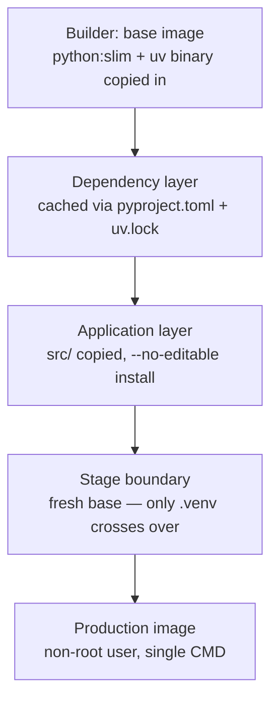

# Phase 2, Step 4: production containerization

This is the working reference for packaging the service into a production
Docker image: the architectural reasoning, the complete multi-stage
`Dockerfile`, and — unusually for this doc series — a full account of nine
real, connected build/run failures encountered while getting there. They're
kept in as a single narrative deliberately: each one is a genuine,
transferable lesson about how `uv`, Docker, and Hugging Face's tooling
interact, and the sequence itself (each fix revealing the next issue) is more
instructive intact than summarized away.

Read [`PHASE_2_STEP_3_DEPENDENCY_MANAGEMENT_GUIDE.md`](PHASE_2_STEP_3_DEPENDENCY_MANAGEMENT_GUIDE.md)
first — this step builds directly on `uv.lock` and the CPU/GPU extras
introduced there.

---

## Part A — Architectural rationale

### Multi-stage builds

A single-stage Dockerfile bakes the entire build toolchain — compilers, `uv`
itself, download caches, intermediate source archives — into the same image
that ships to production, because Docker has no way to distinguish "things I
needed to build this" from "things I need to run this." Multi-stage builds
solve this with multiple `FROM` blocks, each with its own filesystem, where
only artifacts explicitly named in a `COPY --from=<stage>` survive into the
next stage. Everything else is discarded when the build finishes. The payoff
isn't cosmetic: a smaller image means faster pod starts (directly relevant to
Step 2's cold-start window), a smaller attack surface, and a smaller CVE
surface for the same reason Step 3's dependency groups exist.

### The build cache layer, and why `COPY` order is the whole game

Every `RUN`/`COPY` instruction produces a layer, and Docker reuses a cached
layer only if the instruction and its inputs are byte-identical to a previous
build. Critically: **the moment one layer's cache is invalidated, every layer
after it must re-run too**, regardless of whether their own inputs changed.
This is why `COPY pyproject.toml uv.lock ./` happens before `COPY src/`: it
keeps the dependency-install layer — the one holding `torch` — keyed only on
the lockfile's content, so a source-code change never forces a multi-hundred-
megabyte reinstall. `uv sync --no-install-project` is the mechanism that makes
this split possible: it installs everything the project depends on without
installing the project itself, so that step can be its own cached layer,
completely separate from the one that copies and installs actual source code.

### Root as a severe anti-pattern

A container running as root turns any code-execution vulnerability into an
unbounded blast radius — root inside the container can rewrite the
application's own files, tamper with anything else it can see, and in a
container-escape scenario, is the difference between "contained" and "now on
the host." Kubernetes' `securityContext.runAsNonRoot` exists specifically to
let the orchestrator refuse to schedule a pod that would run as UID 0. The
least-privilege model: a dedicated system user with a **fixed numeric
UID/GID** (what `runAsUser` actually checks against, independent of name
resolution), no home directory (it's a service account), and `--chown` on
every `COPY` that lands application files — the common gotcha being creating
the user but leaving the files owned by root, trading "runs as root" for
"crashes with permission denied."

### Worker-to-model concurrency math

The traditional Gunicorn formula — `(2 × CPU cores) + 1` — assumes workers are
cheap. That's backwards here: each worker independently loads a full copy of
`hustvl/yolos-tiny` during its own `lifespan` startup, with no cross-process
sharing. The real ceiling is memory, not CPU:

```
max_workers = floor((available_memory − fixed_overhead) / per_worker_footprint)
```

with VRAM as the binding, less-forgiving constraint whenever a GPU is
involved (a CUDA OOM is a hard crash for that worker, not graceful
degradation). Applying this rigorously to *our* architecture — not just the
formula in isolation — the memory ceiling gets pulled down to exactly **one**
worker per container by a design constraint from Step 2: `lifespan.py`'s
background load task and `app.state` (engine, `active_sessions`,
`shutting_down`) are per-process. More than one worker means independently
loading engines and a `/readyz` that flaps depending on which worker answers
a given probe — the exact failure mode Step 2 was built to prevent. The
correct concurrency lever is Kubernetes replica count, where each replica
independently satisfies the same memory math within its own container.
Gunicorn's traditional role — process supervision — is also redundant here:
Kubernetes already supervises and restarts the container via `restartPolicy`
and the liveness probe.

---

## Part B — The image pipeline



The builder stage uses plain `python:3.12-slim-bookworm` — no compiler, no
`build-essential`. Every dependency here (`torch`, `transformers`, `pillow`,
`fastapi`) ships prebuilt wheels for our target platforms, so nothing
compiles from source. This is also why the base has to be glibc-based
(`-bookworm`), not Alpine (`musl`): PyTorch publishes no `musl`-linked wheels,
so an Alpine base would force building `torch` from source or fail outright.

The application layer installs the project with `--no-editable`, producing a
real, standalone `backend` package inside `.venv` rather than a link back to
the source tree — this is what makes it possible to copy *only* the virtual
environment into the final stage. The production stage starts from a
**fresh** `python:3.12-slim-bookworm` pull, not `FROM builder` — so `uv`
itself, its cache, and anything else that only existed to make the build
happen are never candidates for inclusion unless explicitly named in a
`COPY --from=builder`.

---

## Part C — What changed elsewhere in the project

`--no-editable` has one consequence outside the Dockerfile: `app.py`
previously located the frontend's static assets via a path computed relative
to `__file__` inside the source tree — a tree that no longer exists once
`backend` is installed as a standalone package. Fixed the same way every
other environment-dependent value in this project is handled: through
`Settings`, not a path computation.

```python
# backend/config.py — add one field
class Settings(BaseSettings):
    ...
    # Local dev: resolves relative to cwd (repo root). Container: set to
    # an absolute path via APP_FRONTEND_DIR, since --no-editable means
    # there's no source tree beside the installed package to find one
    # relative to.
    frontend_dir: str = "src/frontend"
```

```python
# backend/app.py — use it instead of a __file__-relative computation
def create_app(app_lifespan=production_lifespan) -> FastAPI:
    ...
    settings = get_settings()
    app.mount("/", StaticFiles(directory=settings.frontend_dir, html=True), name="frontend")
    return app
```

---

## Part D — Full file reference

### `.dockerignore`

```
.venv
.git
__pycache__
*.pyc
.pytest_cache
.ruff_cache
tests/
```

### `pyproject.toml` — the sections this step touches

```toml
[project]
name = "yolos-detection-api"
version = "0.2.0"
description = "FastAPI object-detection service wrapping hustvl/yolos-tiny"
readme = "README.md"
requires-python = ">=3.12,<3.13"

dependencies = [
    "fastapi[standard]>=0.141.1,<1",
    "transformers>=4.40.0,<5",
    "pillow>=11.0,<12",
    "pydantic-settings>=2.6,<3",
]

[project.optional-dependencies]
# torch is chosen explicitly via extra, not derived from platform — see
# Part E, issue 3: platform markers alone can't express "does this Linux
# box have a GPU," since that's a deployment choice, not a platform fact.
cpu = ["torch>=2.5,<3"]
# Restricted to the full x86_64 tuple, not just sys_platform == 'linux'
# — see Part E, issue 4 and issue 9. Without platform_machine here, uv's
# universal resolution tries (and fails) to solve this extra against
# every Linux architecture in `environments` below, not just the one
# that actually has CUDA wheels.
gpu = ["torch>=2.5,<3 ; sys_platform == 'linux' and platform_machine == 'x86_64'"]

[dependency-groups]
test = ["pytest>=8.3,<9", "pytest-asyncio>=0.24,<1", "httpx>=0.27,<1"]
dev = [{ include-group = "test" }, "ruff>=0.7,<1"]

[build-system]
requires = ["hatchling"]
build-backend = "hatchling.build"

[tool.hatch.build.targets.wheel]
packages = ["src/backend"]

[tool.uv]
conflicts = [[{ extra = "cpu" }, { extra = "gpu" }]]
environments = [
    "sys_platform == 'darwin' and platform_machine == 'arm64'",   # native macOS dev — uv run, pytest; no Docker involved
    "sys_platform == 'linux' and platform_machine == 'x86_64'",   # PRODUCTION — the only platform ever deployed
    "sys_platform == 'linux' and platform_machine == 'aarch64'",  # native Docker builds on Apple Silicon — LOCAL DEV CONVENIENCE ONLY, never pushed anywhere (see Part E, issue 9)
]
exclude-newer = "2026-08-01T00:00:00Z"

[[tool.uv.index]]
name = "pytorch-cpu"
url = "https://download.pytorch.org/whl/cpu"
explicit = true

[[tool.uv.index]]
name = "pytorch-cu126"
url = "https://download.pytorch.org/whl/cu126"
explicit = true

[tool.uv.sources]
torch = [
    { index = "pytorch-cpu", extra = "cpu" },
    { index = "pytorch-cu126", extra = "gpu" },
]
```

### `Dockerfile` — complete, with every fix from Part E applied

```dockerfile
# syntax=docker/dockerfile:1

# =============================================================================
# Stage 1: builder
# =============================================================================
FROM python:3.12-slim-bookworm AS builder

# Declared INSIDE this stage, right after its own FROM — a global ARG
# before the first FROM is only visible to FROM lines, never
# automatically to a stage's RUN instructions. See Part E, issue 5.
ARG TORCH_BACKEND=gpu

# uv as a single static binary, copied from Astral's official image
# rather than pip-installed. Pin this to an explicit version tag in real
# CI, for the same reason Step 3 pinned exclude-newer.
COPY --from=ghcr.io/astral-sh/uv:latest /uv /uvx /bin/

ENV UV_COMPILE_BYTECODE=1 \
    UV_LINK_MODE=copy \
    UV_PYTHON_DOWNLOADS=0

WORKDIR /app

# --- Dependency layer: cached independently of source code (Part A) ---
COPY pyproject.toml uv.lock ./
RUN --mount=type=cache,target=/root/.cache/uv \
    uv sync --frozen --no-install-project --no-dev --extra ${TORCH_BACKEND}

# --- Application layer: invalidated only when source actually changes ---
COPY src/ ./src/
COPY README.md ./
# --no-editable: installs `backend` as a real package rather than a link
# back to this source tree, so the final stage can copy the virtual
# environment alone. See Part C for the one place this had a real
# consequence (the frontend static path).
RUN --mount=type=cache,target=/root/.cache/uv \
    uv sync --frozen --no-dev --no-editable --extra ${TORCH_BACKEND}

# =============================================================================
# Stage 2: production — a fresh pull, not `FROM builder`.
# =============================================================================
FROM python:3.12-slim-bookworm AS production

RUN groupadd --system --gid 1000 appuser \
    && useradd --system --uid 1000 --gid appuser --no-create-home appuser

WORKDIR /app

# Hugging Face's cache defaults to $HOME/.cache/huggingface — but $HOME
# resolves to /home/appuser, which --no-create-home deliberately never
# created, and appuser has no permission to create one under /home
# either. Point it at an explicit, purpose-built directory instead,
# created and chowned here. See Part E, issue 8.
ENV HF_HOME=/app/.cache/huggingface
RUN mkdir -p ${HF_HOME} && chown -R appuser:appuser /app

# Only the built virtual environment crosses the stage boundary — no uv
# binary, no build cache, no source distributions.
COPY --from=builder --chown=appuser:appuser /app/.venv /app/.venv
# The frontend's static assets aren't part of the Python package — copied
# separately, to the path APP_FRONTEND_DIR points at below (Part C).
COPY --from=builder --chown=appuser:appuser /app/src/frontend /app/frontend

ENV PATH="/app/.venv/bin:$PATH" \
    PYTHONUNBUFFERED=1 \
    PYTHONDONTWRITEBYTECODE=1 \
    APP_FRONTEND_DIR=/app/frontend

USER appuser

EXPOSE 8000

# uvicorn directly, not `fastapi run` — fastapi-cli expects a file path,
# and --no-editable means there is no source file in this image anymore,
# only the installed `backend` package. See Part E, issue 7.
# --workers 1: the OUTPUT of Part A's memory math for this architecture,
# not an oversight — scale via Kubernetes replica count instead.
# --proxy-headers: trust X-Forwarded-* from the ingress in front of this
# pod, so client IP/protocol info survives the hop.
CMD ["uvicorn", "backend.app:app", "--host", "0.0.0.0", "--port", "8000", "--workers", "1", "--proxy-headers"]
```

---

## Part E — The full debugging narrative

Nine real, connected issues, in the order they were actually hit. Several
only became visible because an earlier fix removed what had been masking
them — worth reading in order for that reason, not just as an index.

| # | Issue | Symptom | Root cause | Fix |
|---|---|---|---|---|
| 1 | Lockfile/Python version drift | `uv sync --frozen` inside the build: *"No interpreter found for Python ==3.11.\*"* | `uv.lock` had a stale recorded Python requirement that no longer matched `pyproject.toml`'s `requires-python`, and `--frozen` trusts the lock completely without cross-checking it | `uv lock` to regenerate against the current constraint; commit the two files together. Add `uv sync --locked` as an explicit CI gate *before* the Docker build, so this surfaces as a clear message in seconds, not a cryptic error three layers into a build log |
| 2 | Docker's default build platform | *"The current Python platform is not compatible with the lockfile's supported environments"* | Docker Desktop on Apple Silicon defaults to building `linux/arm64` — never declared in `tool.uv.environments`, which only listed `darwin/arm64` (dev) and `linux/x86_64` (prod) | Pass `--platform=linux/amd64` explicitly on the `docker build` command |
| 3 | CUDA runtime libraries always installed | `nvidia-*` packages present in the venv regardless of whether the deployment target has a GPU | `tool.uv.sources` routed `torch` by `sys_platform` alone — it can't express "does this Linux box have a GPU," since that's a deployment choice, not a platform fact | Split `torch` into `cpu`/`gpu` extras with `tool.uv.conflicts`, selected explicitly at sync/build time rather than inferred from platform |
| 4 | Universal resolution across every extra × platform combination | `uv lock`: *"No solution found... torch>=2.6.0+cu126 cannot be used"* for `darwin` | `uv lock`'s universal resolution tries every declared environment against every extra; nothing had told it the `gpu` extra was meaningless on macOS (PyTorch publishes no CUDA wheels for macOS) | Add a marker directly to the requirement string inside the extra (`torch>=2.5,<3 ; sys_platform == 'linux'`), so the requirement simply doesn't apply — and is trivially satisfiable — on the excluded platform |
| 5 | Docker `ARG` scoping | `uv sync ... --extra ${TORCH_BACKEND}`: *"a value is required for '--extra <EXTRA>' but none was supplied"* | `ARG` scope is per build-stage. A global `ARG` declared before the first `FROM` is only visible to `FROM` lines themselves — a stage's `RUN` instructions only see it if the stage re-declares it after its own `FROM` | Move `ARG TORCH_BACKEND=gpu` to immediately after `FROM ... AS builder` |
| 6 | Hardcoded `--platform` in `FROM` | Docker build-check warning: `FromPlatformFlagConstDisallowed` | A literal `--platform=linux/amd64` baked into the Dockerfile's `FROM` line permanently locks every build of that file to one platform, and can't be overridden by the build command | Remove `--platform` from `FROM` entirely; keep it only on the `docker build` invocation, consistent with how every other "which target" decision in this project lives in the invoking command/CI config, not the artifact |
| 7 | `fastapi run` vs. an installed package | Container starts, then: *"Path does not exist src/backend/app.py"* | `--no-editable` installs `backend` as a real package with no source tree present in the final image — but the `CMD` still pointed `fastapi run` at a file path, and `fastapi-cli` fundamentally expects a file or package *directory*, not an installed module | Invoke `uvicorn backend.app:app` directly — its CLI has always supported `module:attribute` import strings, independent of where source physically lives |
| 8 | Hugging Face cache permissions | `PermissionError` at `/home/appuser` when downloading `hustvl/yolos-tiny` | The non-root user was created with `--no-create-home`, so `$HOME` resolves to a path that was never created and that `appuser` has no permission to create under `/home` | Set `HF_HOME` to an explicit directory under `/app`, created and `chown`'d to `appuser` at build time |
| 9 | QEMU emulation cost on Apple Silicon | Correct `linux/amd64` builds run, but slowly and with heavy laptop heat/fan noise during local iteration | Cross-architecture builds on Apple Silicon run under emulation, which is real CPU overhead, not a bug | Added `linux/aarch64` as a third resolved environment for **local dev convenience only** — with the issue-4 marker fix applied *proactively* to the `gpu` extra (restricted to `x86_64` specifically, not just `sys_platform == 'linux'`) to prevent the identical failure recurring on this new platform. Production images are still built and pushed exclusively with `--platform=linux/amd64`; this addition never changes what ships |

---

## Part F — Build and run commands

```bash
# Production (GPU) — the only combination that should ever be pushed to a registry
docker build --platform=linux/amd64 --build-arg TORCH_BACKEND=gpu -t yolos-detection-api:gpu .

# CPU variant — CI runners, CPU-only tiers
docker build --platform=linux/amd64 --build-arg TORCH_BACKEND=cpu -t yolos-detection-api:cpu .

# Local iteration on Apple Silicon — native, no emulation, no laptop heat.
# NEVER pushed to a registry, never deployed anywhere.
docker build --platform=linux/arm64 --build-arg TORCH_BACKEND=cpu -t yolos-detection-api:local-arm64 .

# Run (matches whichever image was built)
docker run --platform=linux/amd64 -p 8000:8000 yolos-detection-api:gpu
```

**The one rule this whole step earns**: `--platform=linux/amd64` is mandatory
on any build whose image might be pushed or deployed, and is never implicit.
CI should never rely on the daemon's default — it should state the target
explicitly, the same way `uv sync --locked` explicitly states "the lockfile
must already be correct" rather than trusting it silently.
