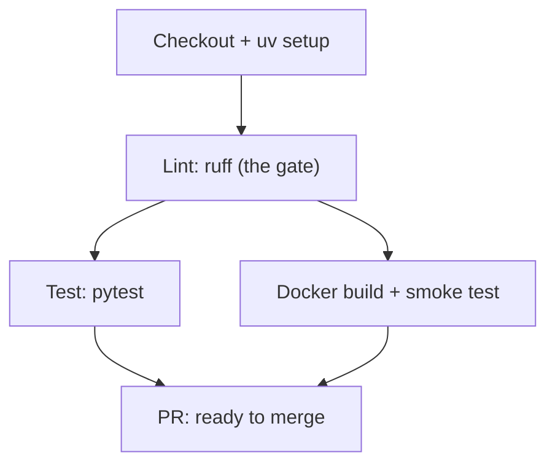

# Phase 3, Step 1: CI/CD automation & local validation

This is the working reference for the automated gatekeeper wrapped around
every push and PR: the GitHub Actions pipeline, the local pre-push hooks that
mirror it, and — like the Phase 2 Step 4 doc — a full account of the real
issues hit getting it right. Ten of them this time, spanning the workflow
itself, the pre-commit setup, and two separate layers of the same test
fixture bug. They're kept as one connected narrative because several only
became visible once an earlier fix was in place.

Read [`PHASE_2_STEP_4_CONTAINERIZATION_GUIDE.md`](PHASE_2_STEP_4_CONTAINERIZATION_GUIDE.md)
first — this step's Docker validation job builds directly on that image.

---

## Part A — Architectural rationale (recap)

**Lint and test alone is a partial gate.** None of Phase 2 Step 4's nine
Docker issues would have been caught by `ruff` or `pytest` — every one lived
inside the `docker build` step. A pipeline that stops at "the Python is
correct" is validating a different artifact than the one that ships. This
pipeline builds and smoke-tests the actual production image on every PR.

**`uv sync --locked` enforces determinism, not just convenience.** Without
it, a runner with a stale lock would silently re-resolve to something new
instead of failing — meaning CI could validate a different dependency set
than what's actually committed. `--locked` turns that into a fast, clear
failure instead of quiet drift.

**Two independent caches, because they cache different things**: `uv`'s
package cache (`astral-sh/setup-uv`'s `enable-cache: true`, keyed on
`uv.lock`) and Docker's BuildKit layer cache (`cache-from: type=gha`,
`cache-to: type=gha,mode=max` — `mode=max` specifically, since without it
only the *final* stage's layers get cached, silently losing the builder
stage's expensive dependency-install layer on a multi-stage Dockerfile).
GitHub's standard runners are natively `linux/amd64`, so unlike local Apple
Silicon builds, this pipeline never pays a QEMU emulation cost.

---

## Part B — The job graph



`lint` runs alone, first — a fast, cheap fail that stops `test` and the
multi-minute Docker build from ever starting over something as trivial as a
formatting error. Once it passes, `test` and `docker-build` both declare
`needs: lint` — not each other — so they run **concurrently**. Total pipeline
time becomes `lint_time + max(test_time, docker_build_time)`, not the sum of
all three.

---

## Part C — The local validation layer

CI is the actual enforced gate; the pre-push hooks exist purely so the same
checks run in seconds, locally, before a push — catching most failures
before they ever reach GitHub. Two design choices worth understanding, not
just copying:

**Local hooks via `uv run`, not the `ruff-pre-commit` mirror repo.** The
common pattern pins `ruff`'s version independently, in the hook config
itself (`rev: v0.x.x`), which is a *second*, separately-maintained version
pin for a tool `uv.lock` already pins once. If the two ever drift, a clean
pre-push hook and a failing CI (or the reverse) becomes possible — which
defeats the entire point of the hook being a trustworthy preview of what CI
will say. `language: system` + `entry: uv run ruff ...` means there is
structurally only one `ruff` version anywhere in this project.

**Installed at the `pre-push` stage, not `pre-commit`.** Matches what was
actually asked for — checked before *pushing* — without blocking WIP commits
along the way.

---

## Part D — Full file reference

### `.github/workflows/ci.yml`

```yaml
name: CI

on:
  pull_request:
    branches: [master]
  push:
    branches: [master]
  workflow_dispatch: # manual "Run workflow" button, no inputs needed

permissions:
  contents: read

concurrency:
  group: ci-${{ github.workflow }}-${{ github.ref }}
  cancel-in-progress: true

jobs:
  lint:
    name: Lint (ruff)
    runs-on: ubuntu-latest
    steps:
      - uses: actions/checkout@v4
      - uses: astral-sh/setup-uv@v8.1.0
        with:
          enable-cache: true
      # No --extra at all: ruff never imports or executes the code it
      # analyzes, so it needs nothing from either the cpu or gpu extra.
      # See Part E, issue 1.
      - run: uv sync --locked --group dev
      - run: uv run ruff check .
      - run: uv run ruff format --check .

  test:
    name: Test (pytest)
    needs: lint
    runs-on: ubuntu-latest
    steps:
      - uses: actions/checkout@v4
      - uses: astral-sh/setup-uv@v8.1.0
        with:
          enable-cache: true
      # --extra cpu IS required here, even though no test touches torch
      # directly: app.py's default app_lifespan argument imports
      # lifespan.py, which imports yolos_engine.py, which imports torch,
      # at module-load time. cpu, not gpu — this suite never runs real
      # inference. See Part E, issue 1 and issue 5.
      - run: uv sync --locked --group dev --extra cpu
      - run: uv run pytest

  docker-build:
    name: Docker build validation
    needs: lint
    runs-on: ubuntu-latest
    steps:
      - uses: actions/checkout@v4
      - uses: docker/setup-buildx-action@v3
      - uses: docker/build-push-action@v6
        with:
          context: .
          platforms: linux/amd64
          push: false
          load: true
          tags: yolos-detection-api:ci
          build-args: |
            TORCH_BACKEND=cpu
          cache-from: type=gha
          cache-to: type=gha,mode=max
      - name: Smoke test the built image
        run: docker run --rm yolos-detection-api:ci python -c "import backend.app; backend.app.create_app()"
```

### `.pre-commit-config.yaml`

```yaml
repos:
  - repo: local
    hooks:
      - id: ruff-check
        name: ruff check (via uv)
        entry: uv run ruff check --fix
        language: system
        types: [python]

      - id: ruff-format
        name: ruff format (via uv)
        entry: uv run ruff format
        language: system
        types: [python]

      - id: pytest
        name: pytest (via uv)
        entry: uv run --extra cpu --group dev pytest
        language: system
        types: [python]
        # Without this, pre-commit appends the list of changed files as
        # arguments to `entry` — correct for ruff (lint just what
        # changed), wrong for pytest (it would try to treat filenames as
        # test-selection args). Always run the whole suite instead.
        pass_filenames: false
```

Install once per clone: `pre-commit install --hook-type pre-push`.

### `Makefile`

```makefile
.PHONY: sync test lint lint-fix

sync:
	uv sync --locked --group dev --extra cpu

test:
	uv run --extra cpu --group dev pytest

# Matches CI exactly — check only, mutates nothing.
lint:
	uv run ruff check .
	uv run ruff format --check .

# Convenience only — mutates files, doesn't guarantee CI passes.
lint-fix:
	uv run ruff check --fix .
	uv run ruff format .
```

### `pyproject.toml` — addition

```toml
dev = [
    { include-group = "test" },
    "ruff>=0.7,<1",
    "pre-commit>=4.0,<5",
]
```

### `tests/conftest.py` — both fixture fixes

```python
def _make_test_lifespan(engine: FakeDetectionEngine):
    @asynccontextmanager
    async def _lifespan(app: FastAPI):
        app.state.engine = engine
        # Added: Step 2 (Phase 2) introduced these on app.state, but this
        # helper predates that and was never updated. See Part E, issue 8.
        app.state.active_sessions = set()
        app.state.shutting_down = False
        yield
    return _lifespan


@pytest.fixture
def client(app) -> TestClient:
    # `with` is load-bearing: TestClient only runs the ASGI lifespan
    # protocol (and therefore _make_test_lifespan's body) when used as a
    # context manager. A bare TestClient(app) never populates app.state
    # at all. See Part E, issue 9.
    with TestClient(app) as c:
        yield c
```

### `tests/api/test_detection.py` — the fixture-based rewrite

```python
def test_detect_returns_503_when_the_real_engine_is_not_ready(client_with_unready_engine):
    """Uses the dedicated fixture — no import needed, pytest injects it
    automatically from conftest.py regardless of subfolder depth."""
    response = client_with_unready_engine.post("/detect", files={"file": ("t.jpg", b"x", "image/jpeg")})
    assert response.status_code == 503
```

---

## Part E — The full debugging narrative

| # | Issue | Symptom | Root cause | Fix |
|---|---|---|---|---|
| 1 | `nvidia.*` installed for a pure lint step | Lint job console log showed CUDA runtime packages being installed | The lint job's `uv sync` had an `--extra` attached to it; `ruff` is static analysis and never imports the code it checks, so it needs neither extra | Remove `--extra` entirely from the lint job's `uv sync` |
| 2 | `ModuleNotFoundError: No module named 'tests'` during collection | A test file did `from tests.conftest import FakeDetectionEngine, _make_test_lifespan` | Ordinary Python imports require `tests` to be a proper importable package; it deliberately isn't one — `conftest.py` fixtures are meant to be auto-discovered by pytest, not imported | Take the fixture (`client_with_unready_engine`) as a test parameter instead of importing conftest internals directly |
| 3 | `F821 Undefined name` after the issue-2 fix | `ruff check` flagged `FakeDetectionEngine`/`_make_test_lifespan` as undefined | The import line was deleted, but the function body still constructed those names inline — the first fix was incomplete, not wrong | Replace the whole function with the fixture-parameter version, not just the import line |
| 4 | `ModuleNotFoundError: No module named 'backend'` testing the hook manually | `uv run pre-commit run ...` failed even though `uv run pytest` alone worked | The manual test command wrapped an outer `uv run` around a `pytest` hook whose own `entry` is *also* `uv run` — the nested invocation inherited an inconsistent environment context | Test the hook the way it actually fires: `.venv/bin/pre-commit run ...`, no outer `uv run` wrapper |
| 5 | "Does a bare `uv sync` fall back to plain PyPI torch?" | Suspected unwanted torch install without `--extra` | False alarm — traced to a corrupted/stale `.venv` from earlier testing, not real uv behavior. Extras are strictly opt-in by the Python packaging spec; there is no silent fallback | Clean-room rebuild (`rm -rf .venv && uv sync ...`) confirmed a bare sync correctly installs no torch at all |
| 6 | `torch` briefly added to `[project.dependencies]` directly | — | A manual edit reintroduced torch as an unconditional dependency, defeating the cpu/gpu extras split from Phase 2 Step 3 | Removed; torch stays exclusively under the `cpu`/`gpu` extras |
| 7 | Wanting torch "always installed" without a flag | — | Extras are opt-in by specification — confirmed by Astral's own official uv+PyTorch guide, which documents this exact toggle-by-extra pattern as the recommended approach, not a workaround | No pyproject.toml mechanism for this; solved procedurally instead — `make sync` as the one canonical, always-complete sync command |
| 8 | `AttributeError: 'State' object has no attribute 'shutting_down'` — layer 1 | WebSocket test failed; 14 others passed | `_make_test_lifespan` (written in Phase 2 Step 1) only ever set `app.state.engine`, predating Step 2's `active_sessions`/`shutting_down` additions to the real lifespan | Add both fields to `_make_test_lifespan` |
| 9 | Same error persisted after issue 8's fix — layer 2, the real root cause | Identical `AttributeError` | The `client` fixture returned a bare `TestClient(app)` — never used as a context manager, so the ASGI lifespan protocol (and therefore `_make_test_lifespan`'s body, correct or not) never ran at all. Invisible everywhere else because `dependency_overrides` replaces `get_engine`'s entire body, and only the WebSocket route reads `app.state` directly with no override layer in between | Wrap it: `with TestClient(app) as c: yield c` — matching what `client_with_unready_engine` already did correctly |
| 10 | Makefile drift from the CI-matching commands | Caught during this doc pass, not yet a live failure | `test:` omitted `--extra cpu`, risking `uv run`'s implicit resync silently uninstalling torch between `make sync` and `make test`; `lint:` applied fixes/formatting rather than checking, so a clean `make lint` didn't actually guarantee CI would pass | `test` now repeats `--extra cpu --group dev` explicitly; `lint` (check-only, matches CI) and `lint-fix` (mutates, convenience) split into two targets |

---

## Part F — Running it

```bash
make sync        # the one canonical setup command — always complete, never missing torch
make lint         # matches CI exactly — safe to run anytime, changes nothing
make lint-fix     # auto-fixes what it safely can — review the diff before committing
make test         # full suite, cpu extra, same as CI

pre-commit install --hook-type pre-push   # once per clone
pre-commit run --all-files --hook-stage pre-push   # test the hook without waiting for a real push
```

A pushed commit now goes through, in order: the pre-push hook locally
(seconds), then GitHub's `lint` job (seconds), then `test` and
`docker-build` in parallel (the pipeline's longest step, still capped by
whichever of the two is slower — not their sum).
