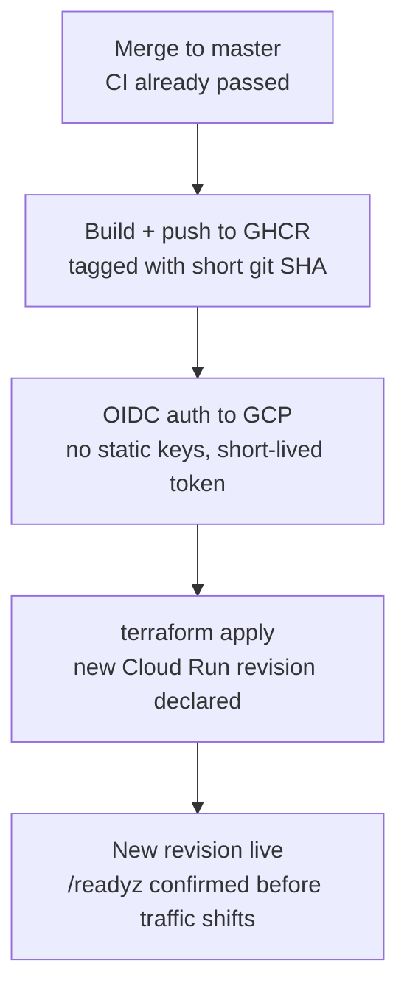

# Phase 3, Step 3: Infrastructure as Code & GitOps Continuous Deployment

This is the working reference for automating what Phase 3, Step 2 proved by
hand: Terraform declaring the Cloud Run service, and a GitHub Actions
pipeline that builds, pushes, and deploys it on every merge to `master`,
authenticated to GCP with no static keys anywhere. This step produced the
richest debugging arc of the whole project — ten real, distinct issues, and
one full architectural reversal made *because of*, not despite, hitting
repeated real friction. All of it is documented here as it actually
happened, because the sequence itself — several issues only surfacing once
an earlier one was fixed — is more instructive intact than summarized away.

Read [`PHASE_3_STEP_2_CLOUD_RUN_DEPLOYMENT_GUIDE.md`](PHASE_3_STEP_2_CLOUD_RUN_DEPLOYMENT_GUIDE.md)
first — this step automates exactly what that one did manually, and several
issues here exist specifically *because* that deployment was manual.

---

## Part A — Architectural rationale

**Declarative vs. imperative.** Every `gcloud` command in Step 2 was
imperative — instructions describing *how* to reach a state, not
idempotent by default, correctness dependent on remembering the right
sequence against whatever the current reality happened to be. Terraform is
declarative: `main.tf` states what the world *should* look like, and
Terraform computes and applies only the diff. Run `terraform apply` twice
with nothing changed, and the second run does nothing — which is precisely
what makes automating it safe. This is also why professional teams mandate
that infrastructure changes go through source control and review: `.tf`
files are diff-able, reviewable text, the same way a code PR is, with the
same audit trail and the same ability to roll back a specific, known change.

**The state file.** `terraform.tfstate` maps what's declared in `.tf` files
to the actual resource IDs and attributes that exist in GCP. It often
contains sensitive values in plaintext (any credential Terraform provisions
and must track), and even without one, it's a complete map of the
infrastructure's exact configuration — real reconnaissance value if exposed.
Best practice: a remote GCS backend, never local, never committed, with
bucket versioning (rollback a corrupted state write) and IAM access
restricted to exactly the CI service account and specific operators. The GCS
backend also provides native state locking, preventing two concurrent
applies from corrupting each other.

**Immutable tags.** `:latest` is a mutable pointer — the same tag can point
at different image content over time, which breaks Terraform's diff model
directly: if the declared image string never changes between deploys, a
diff against it may never even trigger a new revision. Pinning to the short
Git commit SHA gives a permanent, unique tag per deploy — `git show <sha>`
tells you exactly what's live, and rollback means redeploying an exact,
known set of bytes. It has a second, concrete payoff specific to this
project: a brand-new tag that's never been pulled before cannot hit the
GHCR caching-proxy staleness bug from Step 2 — that bug was specifically
about a stale cached failure for a *previously seen* tag.

---

## Part B — The GitOps lifecycle



One deliberate choice worth restating: the CD workflow triggers on
`workflow_run` for the CI workflow's completion, not a bare `push` to
`master` — tying deployment directly to CI's verified result for that exact
commit, rather than trusting branch protection alone.

---

## Part C — What's new since Step 2

```
infra/
└── main.tf                       # Cloud Run service, Secret Manager, IAM — all declared, not imperative

.github/workflows/
└── cd.yml                        # build → push (GHCR) → OIDC auth → terraform apply, on CI success
```

`hf_token` (Hugging Face Hub authentication) is a genuinely new addition
mid-step — this project's first real secret, added in direct response to
Issue 6 below, not as a planned exercise.

---

## Part D — Full reference: the final, working configuration

### One-time setup — the complete, consolidated sequence

This is every command that actually turned out to be necessary, in the
right order — not the order they were discovered in. Following this exact
sequence on a fresh project should avoid all ten issues in Part E.

```bash
PROJECT_ID="ml-project-506908"
PROJECT_NUMBER="494443276988"
REPO="mohawwad93/YOLOsObjectDetectionAPI"

# 1. Every API this setup depends on. Deliberately a human bootstrap
# step, not Terraform-managed — see Issues 7-9 for why.
gcloud services enable \
  run.googleapis.com \
  iam.googleapis.com \
  iamcredentials.googleapis.com \
  secretmanager.googleapis.com \
  storage.googleapis.com \
  cloudresourcemanager.googleapis.com \
  --project=$PROJECT_ID

# 2. The service account GitHub Actions will impersonate
gcloud iam service-accounts create github-actions-deployer \
  --display-name="GitHub Actions CD deployer" --project=$PROJECT_ID

# 3. Every role it actually needs — consolidated from what each issue
# below discovered incrementally
for ROLE in run.admin iam.serviceAccountUser storage.admin \
            secretmanager.admin iam.serviceAccountAdmin; do
  gcloud projects add-iam-policy-binding $PROJECT_ID \
    --member="serviceAccount:github-actions-deployer@${PROJECT_ID}.iam.gserviceaccount.com" \
    --role="roles/${ROLE}"
done

# 4. Workload Identity Pool + Provider, scoped to this exact repo
gcloud iam workload-identity-pools create "github-pool" \
  --location="global" --display-name="GitHub Actions Pool" --project=$PROJECT_ID

gcloud iam workload-identity-pools providers create-oidc "github-provider" \
  --location="global" --workload-identity-pool="github-pool" \
  --display-name="GitHub Provider" \
  --attribute-mapping="google.subject=assertion.sub,attribute.repository=assertion.repository" \
  --attribute-condition="assertion.repository=='${REPO}'" \
  --issuer-uri="https://token.actions.githubusercontent.com" \
  --project=$PROJECT_ID

gcloud iam service-accounts add-iam-policy-binding \
  "github-actions-deployer@${PROJECT_ID}.iam.gserviceaccount.com" \
  --role="roles/iam.workloadIdentityUser" \
  --member="principalSet://iam.googleapis.com/projects/${PROJECT_NUMBER}/locations/global/workloadIdentityPools/github-pool/attribute.repository/${REPO}"

# 5. Terraform state bucket — bootstrap only, never managed by main.tf
gsutil mb -l us-central1 gs://YOUR_UNIQUE_BUCKET_NAME-tfstate
gsutil versioning set on gs://YOUR_UNIQUE_BUCKET_NAME-tfstate

# 6. Import the resources Step 2 already created manually — Terraform
# has no record of anything it didn't create itself (Issue 4)
cd infra && terraform init
terraform import google_cloud_run_v2_service.api \
  projects/${PROJECT_ID}/locations/us-central1/services/yolos-detection-api
terraform import google_cloud_run_v2_service_iam_member.public_access \
  "projects/${PROJECT_ID}/locations/us-central1/services/yolos-detection-api roles/run.invoker allUsers"
```

Also required, outside `gcloud` entirely:
- **GHCR package → Package settings → Manage Actions access → Add
  Repository → Write** (Issue 2) — without this, the repo's own
  `GITHUB_TOKEN` cannot push to a package that was first published manually.
- **`HF_TOKEN` as a GitHub Actions repository secret** (Issue 6), sourced
  from a read-scoped token at `huggingface.co/settings/tokens`.

### `Dockerfile` — one addition

```dockerfile
# Links this image to its source repo on GHCR automatically for any
# FUTURE first-time package this project publishes — the package only
# inherits repo Actions permissions if this is present BEFORE the
# first publish. Doesn't retroactively fix an already-existing package.
LABEL org.opencontainers.image.source="https://github.com/mohawwad93/YOLOsObjectDetectionAPI"
```

### `infra/main.tf` — complete

```hcl
terraform {
  required_version = ">= 1.7"

  required_providers {
    google = {
      source  = "hashicorp/google"
      version = "~> 6.0"
    }
  }

  backend "gcs" {
    bucket = "YOUR_UNIQUE_BUCKET_NAME-tfstate"
    prefix = "yolos-detection-api/state"
  }
}

provider "google" {
  project = var.project_id
  region  = var.region
}

variable "project_id" {
  type        = string
  description = "GCP project ID"
}

variable "region" {
  type    = string
  default = "us-central1"
}

variable "container_image" {
  type        = string
  description = "Full image reference INCLUDING an immutable tag (short git SHA) — never :latest"
}

variable "hf_token" {
  type        = string
  description = "Hugging Face Hub access token — read scope is sufficient"
  sensitive   = true
}

# --- Secret Manager: Hugging Face Hub authentication ---
# Added after a real production incident (Issue 6): anonymous
# huggingface.co requests share Cloud Run's egress IP pool with many
# other GCP tenants and got rate-limited (429) during a cold start —
# which our own fail-fast engine.load() correctly caught and reported
# via /readyz, proving the Phase 2 health-check design.
resource "google_secret_manager_secret" "hf_token" {
  secret_id = "hf-token"
  replication {
    auto {}
  }
}

# Worth being precise about what this protects: this value DOES land
# in Terraform state for this resource, in plaintext — this isn't
# "secrets that never touch state," it's why the state file's own
# security (Part A) matters as much as it does. What Secret Manager
# buys: access-controlled runtime injection, rotation, audit logging —
# never hardcoded in a .tf file, never committed.
resource "google_secret_manager_secret_version" "hf_token" {
  secret      = google_secret_manager_secret.hf_token.id
  secret_data = var.hf_token
}

# A dedicated RUNTIME identity for the service itself — distinct from
# github-actions-deployer, which only ever deploys it. Least privilege:
# this identity can read exactly one secret and nothing else.
resource "google_service_account" "cloud_run_runtime" {
  account_id   = "yolos-api-runtime"
  display_name = "yolos-detection-api Cloud Run runtime identity"
}

resource "google_secret_manager_secret_iam_member" "hf_token_access" {
  secret_id = google_secret_manager_secret.hf_token.id
  role      = "roles/secretmanager.secretAccessor"
  member    = "serviceAccount:${google_service_account.cloud_run_runtime.email}"
}

resource "google_cloud_run_v2_service" "api" {
  name     = "yolos-detection-api"
  location = var.region

  # Requires deliberate action to delete — a safeguard against an
  # accidental `terraform destroy` touching the one thing serving users.
  deletion_protection = true

  template {
    service_account = google_service_account.cloud_run_runtime.email

    containers {
      image = var.container_image

      ports {
        container_port = 8000
      }

      resources {
        limits = {
          cpu    = "1"
          memory = "2Gi" # sizing reasoning: Phase 3, Step 2, Part A
        }
      }

      env {
        name = "HF_TOKEN"
        value_source {
          secret_key_ref {
            secret  = google_secret_manager_secret.hf_token.secret_id
            version = "latest"
          }
        }
      }

      # Maps directly onto /readyz. port is explicit — Cloud Run
      # defaults http_get.port to the container's own port when
      # omitted, but stating it removes any ambiguity (Issue 5).
      startup_probe {
        http_get {
          path = "/readyz"
          port = 8000
        }
        initial_delay_seconds = 0
        period_seconds        = 5
        failure_threshold     = 12
        timeout_seconds       = 3
      }

      liveness_probe {
        http_get {
          path = "/healthz"
          port = 8000
        }
        period_seconds    = 30
        failure_threshold = 3
        timeout_seconds   = 3
      }
    }

    scaling {
      min_instance_count = 0 # non-negotiable — the entire $0/month rationale depends on this
      max_instance_count = 2
    }

    max_instance_request_concurrency = 1
    timeout                          = "300s" # generous, for /ws/detect's long-lived WebSocket sessions
  }

  traffic {
    type    = "TRAFFIC_TARGET_ALLOCATION_TYPE_LATEST"
    percent = 100
  }

  # The secret VERSION (the actual token value) must exist before
  # Cloud Run tries to reference it as an environment variable.
  depends_on = [
    google_secret_manager_secret_version.hf_token,
  ]
}

resource "google_cloud_run_v2_service_iam_member" "public_access" {
  name     = google_cloud_run_v2_service.api.name
  location = google_cloud_run_v2_service.api.location
  role     = "roles/run.invoker"
  member   = "allUsers"
}

output "service_url" {
  value       = google_cloud_run_v2_service.api.uri
  description = "The live URL of the deployed service"
}
```

**Note what's deliberately absent**: a `google_project_service` resource
for API enablement. It was added, then removed — see Issue 9 for why that
reversal happened and why it's the correct final state, not an unfinished
cleanup.

### `.github/workflows/cd.yml` — complete

```yaml
name: CD

on:
  workflow_run:
    workflows: ["CI"] # must match Step 1 ci.yml's `name:` exactly
    types: [completed]
    branches: [master]

permissions:
  contents: read
  id-token: write  # required to request a GitHub OIDC token at all
  packages: write  # required to push to GHCR with the built-in token

concurrency:
  group: cd-${{ github.workflow }}
  cancel-in-progress: false # NEVER cancel a deploy mid-flight

jobs:
  build-and-deploy:
    if: github.event.workflow_run.conclusion == 'success'
    runs-on: ubuntu-latest
    steps:
      - uses: actions/checkout@v4
        with:
          ref: ${{ github.event.workflow_run.head_sha }} # the EXACT commit CI validated

      - name: Compute immutable image tag
        id: vars
        run: echo "sha_tag=${GITHUB_SHA::7}" >> "$GITHUB_OUTPUT"

      - uses: docker/setup-buildx-action@v3

      - name: Log in to GHCR
        uses: docker/login-action@v3
        with:
          registry: ghcr.io
          username: ${{ github.actor }}
          password: ${{ secrets.GITHUB_TOKEN }}

      - name: Build and push, tagged with the immutable SHA
        uses: docker/build-push-action@v6
        with:
          context: .
          platforms: linux/amd64
          push: true
          build-args: |
            TORCH_BACKEND=cpu
          tags: ghcr.io/${{ github.repository_owner }}/yolos-detection-api:${{ steps.vars.outputs.sha_tag }}
          cache-from: type=gha
          cache-to: type=gha,mode=max

      - name: Authenticate to Google Cloud — OIDC, zero static keys
        uses: google-github-actions/auth@v3
        with:
          project_id: "ml-project-506908"
          workload_identity_provider: "projects/494443276988/locations/global/workloadIdentityPools/github-pool/providers/github-provider"
          service_account: "github-actions-deployer@ml-project-506908.iam.gserviceaccount.com"

      - uses: hashicorp/setup-terraform@v3

      - name: Terraform init
        working-directory: infra
        run: terraform init

      - name: Terraform apply
        working-directory: infra
        env:
          TF_VAR_hf_token: ${{ secrets.HF_TOKEN }}
        run: |
          terraform apply -auto-approve \
            -var="project_id=ml-project-506908" \
            -var="container_image=ghcr.io/${{ github.repository_owner }}/yolos-detection-api:${{ steps.vars.outputs.sha_tag }}"
```

No service account JSON key exists anywhere in this repository, in a
secret, or on disk — `google-github-actions/auth` exchanges GitHub's
short-lived OIDC token for equally short-lived GCP credentials at request
time. No separate GHCR PAT either — `secrets.GITHUB_TOKEN` is minted fresh
per run, scoped by the `permissions:` block, expiring when the job ends.

---

## Part E — The full debugging narrative

Ten issues, in the order actually hit, plus one full architectural reversal.

| # | Issue | Symptom | Root cause | Fix |
|---|---|---|---|---|
| 1 | Invalid workflow YAML | `Invalid workflow file ... A sequence was not expected` | A redaction artifact (`[email protected]`) landed in the file as a literal value — YAML parsed the leading `[` as flow-sequence syntax | Real service account email, with values containing `@`/`/`/`:` quoted as a standing habit |
| 2 | GHCR push `permission_denied: write_package` | CD's `docker push` failed even with `packages: write` in the workflow | The package was first published manually (Step 2), via a personal PAT — packages only auto-inherit repo Actions permissions if linked *before* first publish | Package settings → Manage Actions access → Add Repository → Write. Durable fix: `org.opencontainers.image.source` label in the Dockerfile for any future package |
| 3 | `terraform init` / GCS backend 403 | `IAM Service Account Credentials API has not been used...` | WIF's token *exchange* (impersonation) is a distinct API — `iamcredentials.googleapis.com` — from the general IAM setup already done | `gcloud services enable iamcredentials.googleapis.com` |
| 4 | `Error 409: Resource already exists` | `terraform apply` tried to create a Cloud Run service that already existed | The service was created manually in Step 2 — Terraform's state had zero record of it, since it never created it | `terraform import` for both the service and its public-access IAM binding, then `terraform plan` locally to check for drift before trusting the next auto-apply |
| 5 | Startup probe failure (initial) | `The user-provided container failed the configured startup probe checks` | Investigated: suspected a missing `port` in `http_get`. Cloud Run's documented default is the container's own port, so this likely wasn't the true cause — but added explicitly anyway as zero-risk hardening | `port = 8000` added to both probes; real cause found via Issue 6 |
| 6 | Startup probe failure (real cause) | Cloud Run logs: `429 Too Many Requests` from `huggingface.co`; our own `/readyz` correctly reported `{"engine_status":"failed"}` | Anonymous Hugging Face Hub requests share Cloud Run's egress IP pool with many other GCP tenants; repeated cold starts during this debugging session were enough to trip the rate limit. **Confirms the Phase 2, Step 2 health-check design worked exactly as intended** — it caught a real failure and correctly refused traffic | Authenticated Hub access via an `HF_TOKEN`, injected through Google Secret Manager — this project's first real secret, added from genuine necessity |
| 7 | `iam.googleapis.com` 403 on `google_service_account` creation | `Identity and Access Management (IAM) API has not been used...` | A third, distinct API gap — general IAM operations, separate from both `iamcredentials` (Issue 3) and service usage management | `gcloud services enable iam.googleapis.com` |
| 8 | `serviceusage.services.list` 403 | `google_project_service` resource (added to make API enablement declarative) failed | `github-actions-deployer` lacked `roles/serviceusage.serviceUsageAdmin` | Granted the role — but see Issue 9 |
| 9 | Same `serviceusage.services.list` 403, after the fix | Identical error, even with the role granted | **Architectural reversal, not a permission gap.** Three consecutive failures around the same operation was the actual signal: letting CI manage project-wide API enablement needs a surprisingly broad, hard-to-fully-enumerate permission set. This matches every other genuinely one-time step in this project (WIF, the GCS bucket, the billing budget, GHCR visibility) — a human bootstraps it once, by hand | **Removed `google_project_service` from `main.tf` entirely.** API enablement documented as a prerequisite (Part D), not Terraform-managed. `roles/serviceusage.serviceUsageAdmin` revoked afterward as cleanup, no longer needed |
| 10 | `iam.serviceAccounts.create` denied | `Permission 'iam.serviceAccounts.create' denied...` | `roles/iam.serviceAccountUser` (already granted) only permits *using* an existing service account — creating a new one (`cloud_run_runtime`) needs the distinct `roles/iam.serviceAccountAdmin` | Granted `roles/iam.serviceAccountAdmin`. Confirmed as the last gap by tracing every remaining resource in `main.tf` against what was already granted |

**The general lesson from Issues 7–10, taken together**: most of this
step's friction was IAM permission gaps discovered one resource type at a
time, which is normal for a first IaC pass — each is a narrow, well-defined
fix. Issue 9 is the one exception worth remembering specifically: when the
*same* operation keeps failing after a fix that should have worked,
that's a different signal than "grant one more role" — it's worth asking
whether the architecture itself is asking for something too broad, the way
API-enablement-via-CI turned out to be.

---

## Part F — Suggested improvements (not yet implemented)

- **`terraform plan` on every PR, `apply` only after merge.** The current
  pipeline runs `plan` and `apply` together, unattended, on merge —
  `-auto-approve` with no human reviewing the diff first. The more rigorous
  pattern: post `terraform plan`'s output as a PR comment, so a reviewer
  sees the actual infrastructure change as part of code review, before
  anything happens. Issue 4 is a concrete illustration of exactly why this
  matters — a plan showing "2 to add" against resources known to already
  exist is precisely what a human glancing at a PR would have caught before
  it ever reached `apply`.
- **Scope `roles/storage.admin` down to just the state bucket**, via a
  bucket-level IAM binding rather than a project-wide role — the deployer
  currently has broader storage access than it actually uses.
- **Bake the model into the image at build time**, eliminating the runtime
  Hugging Face Hub dependency entirely rather than authenticating around it.
  This was first raised as an optional idea back in Phase 2, Step 4; Issue 6
  is a concrete demonstration of the class of problem it would remove at
  the source, not just mitigate.
